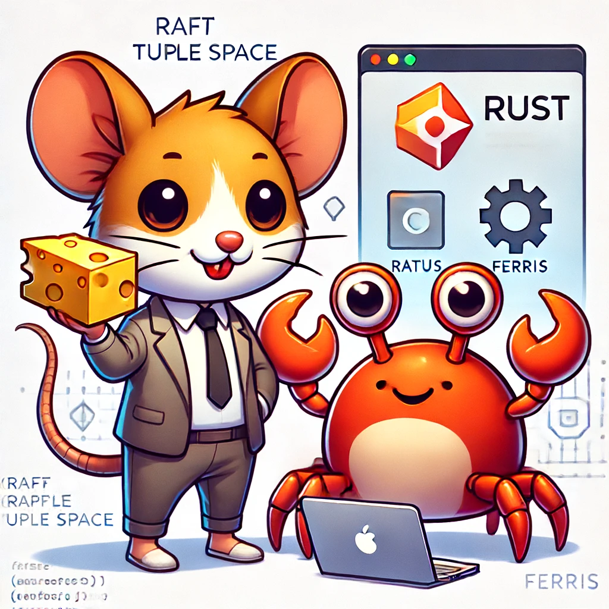

# RaTuS

RaTuS (Raft Tuple Space) is a Tuple Space implemented in Rust supported by the Raft Consensus Algorithm



## Installation (Linux or MacOS)

```bash
make install
```

## Installation (Windows)

Download [Rust Windows Installer](https://win.rustup.rs/) and run it.

## Build

```bash
make build
```

## Test

```bash
make test
```

## Troubleshooting (Linux)

In case of an error while compiling the project, install the following:

```bash
sudo apt-get update
sudo apt-get install libssl-dev
sudo apt install build-essential
```
